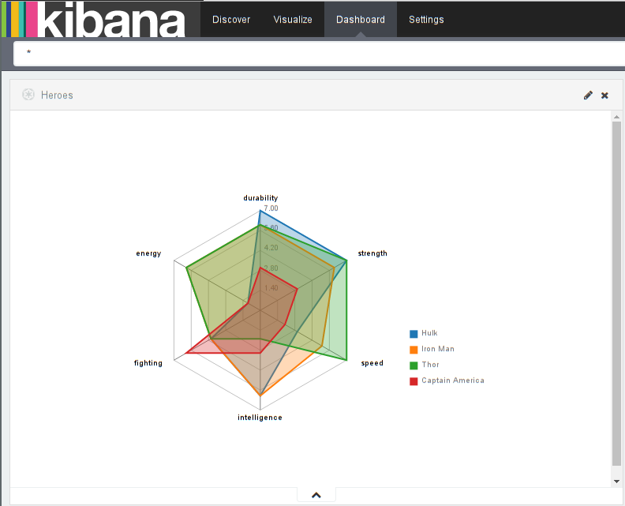
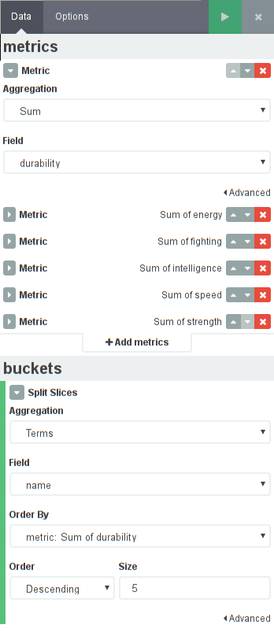

# Kibi/Kibana Radar Chart Plugin

This is a plugin for [Kibana](https://www.elastic.co/products/kibana) and [Kibi](http://siren.solutions/kibi) (our [extention of Kibana for Relational Data](https://www.linkedin.com/pulse/extending-elasticsearch-kibana-do-data-intelligence-kibi-tummarello))

A radar chart is a graphical method of displaying multivariate data in the form of a two-dimensional chart of three or more quantitative variables represented on axes starting from the same point. The relative position and angle of the axes is typically uninformative.


## Compatibility

This plugin can be installed in both:
 
 * [Kibana: 4.3+](https://www.elastic.co/downloads/past-releases/kibana-4-3-0)
 * [Kibi: 0.3+](https://siren.solutions/kibi)

The following table shows the compatibility between releases of Kibi/Kibana and Radar Chart Plugin plugin

Kibi/Kibana|Radar Chart Plugin
-----|-----
4.6.4|master
4.6.3|4.5.3
4.5.x|4.5.3
4.4.x|4.4.2
4.3.x|0.1.0

## Installation

### Automatic

```sh
$ # for kibi
$ ./bin/kibi plugin -i kibi_radar_vis -u  https://github.com/sirensolutions/kibi_radar_vis/archive/4.5.3.zip
$ # for kibana
$ ./bin/kibana plugin -i kibi_radar_vis -u  https://github.com/sirensolutions/kibi_radar_vis/archive/4.5.3.zip
```

### Manual

```sh
$ git clone https://github.com/sirensolutions/kibi_radar_vis.git
$ cd kibi_radar_vis
$ npm install
$ npm run build
$ cp -R build/kibi_radar_vis KIBANA_FOLDER_PATH/installedPlugins/
```

## Uninstall

```sh
$ # for kibi
$ bin/kibi plugin  --remove kibi_radar_vis
$ # for kibana
$ bin/kibana plugin  --remove kibi_radar_vis
```

## Development

- Clone the repository at the same level as you've cloned Kibana (>=4.6.4)
- Switch to the same node version as Kibana using nvm 
  (currently `nvm use 6.9.0`)
- Install dependencies with `npm install`
- Install the plugin to Kibana and start watching for changes by running 
  `npm start`

## Demo



Create a sample index with the commands below and then create a new radar visualization.

```sh
$ curl -XPUT 'http://localhost:9200/hero' -d '
{
  "mappings": {
    "Hero": {
      "properties": {
        "name": {
          "type": "string",
          "index": "not_analyzed"
        }
      }
    }
  }
}
'

$ curl 'http://localhost:9200/hero/Hero' -d '
{
  "name": "Thor",
  "intelligence": 2,
  "strength": 7,
  "speed": 7,
  "durability": 6,
  "energy": 6,
  "fighting": 4,
  "description": "god-like durability"
}
'

$ curl 'http://localhost:9200/hero/Hero' -d '
{
  "name": "Iron Man",
  "intelligence": 6,
  "strength": 6,
  "speed": 5,
  "durability": 6,
  "energy": 6,
  "fighting": 4,
  "description": "smart entreprenuer"
}
'

$ curl 'http://localhost:9200/hero/Hero' -d '
{
  "name": "Captain America",
  "intelligence": 3,
  "strength": 3,
  "speed": 2,
  "durability": 3,
  "energy": 1,
  "fighting": 6,
  "description": "only human"
}
'

$ curl 'http://localhost:9200/hero/Hero' -d '
{
  "name": "Hulk",
  "intelligence": 6,
  "strength": 7,
  "speed": 3,
  "durability": 7,
  "energy": 1,
  "fighting": 4,
  "description": "brilliant scientist"
}
'
```

The metrics define the dimensions of the chart, and should be at least three.
Each colored area is defined in the bucket section, e.g., a hero's name.


