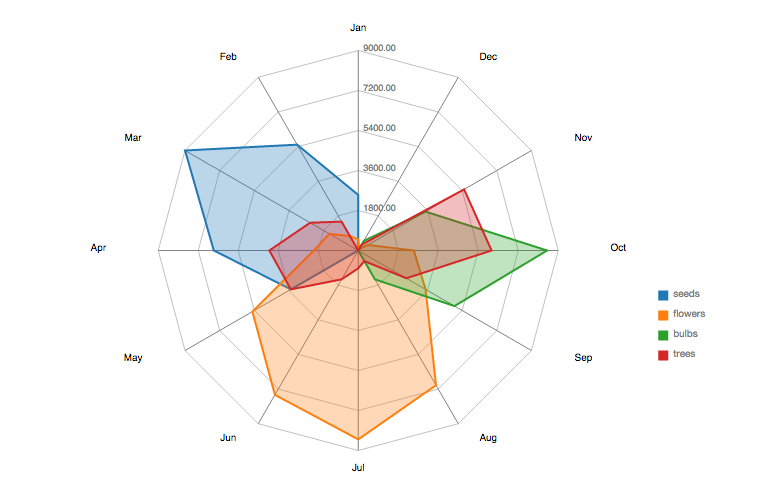
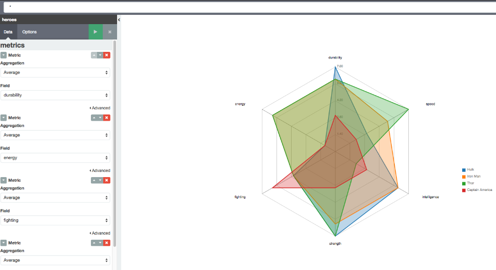

# Kibi/Kibana Radar Chart Plugin

This is a plugin for [Kibana 4.3+](https://www.elastic.co/products/kibana) and [Kibi](http://siren.solutions/kibi) (our extention of Kibana for Relational Data) 0.3.

A radar chart is a graphical method of displaying multivariate data in the form of a two-dimensional chart of three or more quantitative variables represented on axes starting from the same point. The relative position and angle of the axes is typically uninformative.




## Installation

This plugin can be installed in both:
 
 * [Kibana: 4.3](https://www.elastic.co/downloads/past-releases/kibana-4-3-0)
 * [Kibi: 0.3](https://siren.solutions/kibi) (Coming soon ...)

### Automatic

```
bin/kibana plugin --install sirensolutions/kibi-radar-chart-plugin/0.1.0
```

### Manual

```
git clone https://github.com/sirensolutions/kibi-radar-chart-plugin
cd kibi-radar-chart-plugin
npm install
npm run build
cp -R build/kibi_radar_vis KIBANA_FOLDER_PATH/installedPlugins/
```

## Uninstall

```
bin/kibana plugin  --remove kibi-radar-chart-plugin
```

## Development

- Clone the repository at the same level of a Kibana > 4.2 clone
- If needed, switch to the same node version as Kibana using nvm 
  (e.g. `nvm use 0.12`)
- Install dependencies with `npm install`
- Install the plugin to Kibana and start watching for changes by running 
  `npm start`
